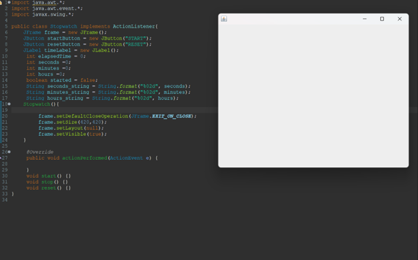
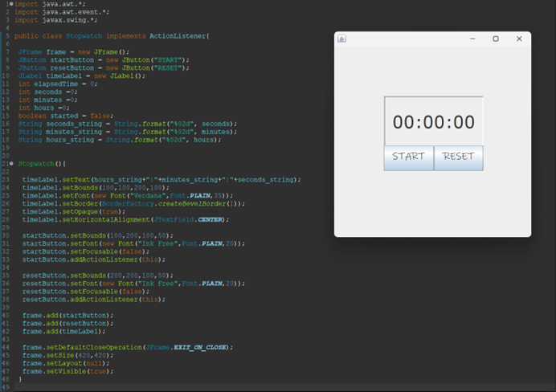
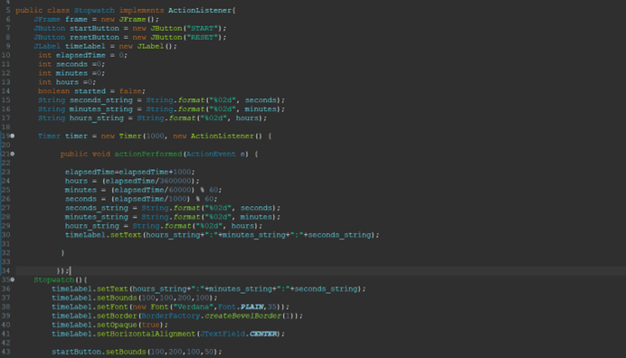
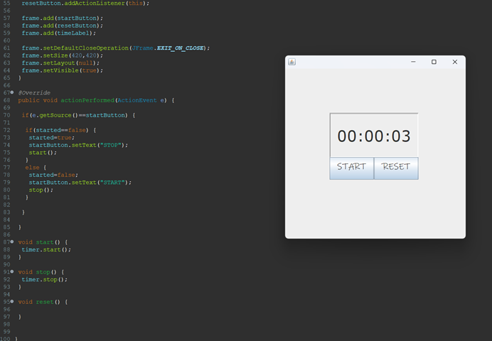
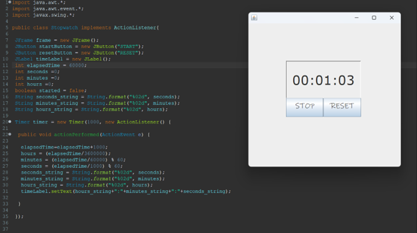
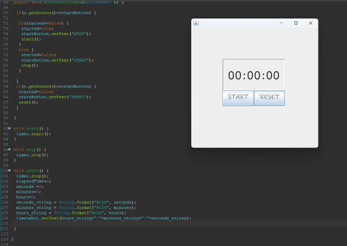

作品構思:我想製作一個Stop Watch具有Start、Reset 與Stop的功能
===========================================

  

我先創建了**一個constructors與三個method**。  
並在上方宣告各個Frame與button的變數， 並使用 String.format() 方法來將 seconds、minutes 和 hours 轉換成帶有前置零的字符串格式， 以便於在標籤中顯示時間時格式化為 00:00:00 的形式。

* * *

我對剛剛宣告的程式碼做設定，

用timeLabel 物件的 setText() 方法用來**顯示時間**， 並用timeLabel 物件的 setBounds() 方法用來設定物件在視窗中的**位置和大小**，  
最後用frame 物件的 add() 方法，將 startButton、resetButton 和 timeLabel 這些物件添加到 frame 物件中，以便它們可以顯示在視窗中。

* * *

接下來我設定觸發start之後會出現的效果，程式會先將經過的時間（elapsedTime）增加1000毫秒（1秒）， 然後將時間轉換成時、分、秒的格式。  
hours會計算elapsedTime經過的小時數， minutes和seconds分別計算elapsedTime經過的分鐘數和秒數， 但由於分鐘和秒鐘的時間可能會超過60秒，所以要取餘數才能得到正確的分鐘和秒鐘數字。

* * *

我利用**if else statement來製作start呼叫的效果**， 程式會先檢查事件來源是否為「START」按鈕 (startButton)。  
如果是，就會檢查是否已經開始運行計時器 (started==false)。 如果計時器尚未啟動，程式會將 started 設為 true，並且將按鈕的文字變更為「STOP」。  
接著，它會呼叫 start() 方法，該方法會啟動計時器 (timer.start())。如果計時器已經啟動， 程式會將 started 設為 false，並將按鈕的文字變更為「START」。  
接著，它會呼叫 stop() 方法，該方法會停止計時器 (timer.stop())。

* * *

最後是Reset Button，我希望**按下去數字都能歸零**所以我透過 String.format() 方法將秒數、分鐘數和小時數的格式轉換成「00」的格式，  
再將時間格式化後顯示在畫面上的 timeLabel 元件上。

* * *

成果展示

--------

按下Start Button

* * *

按下Reset Button

